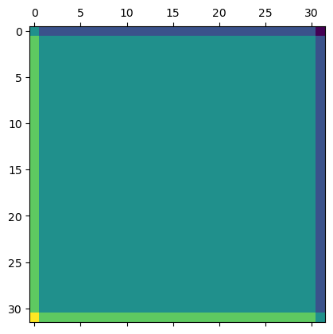
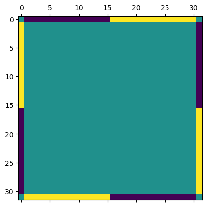

# Skeletal Multigrid Experiments
This repository contains the code to reproduce experiments from Section 5.3 of the paper "Graph Lineages and Skeletal Graph Products", currently under review (arXiV link TBD).

## Usage

python run_expt.py [SOLVER] [PROBLEM] [SEED]

run_expt.py has several input parameters:
- SOLVER: which of the solvers in solvers.py to use. Options are:
    - gs: Gauss-Seidel.
    - mg1: Multigrid V-cycles
    - mg2: Multigrid W-cycles
    - sk1: Skeletal Multigrid V-cycles
    - sk2: Skeletal Multigrid W-cycles
    - lsk1: Levelwise Skeletal Multigrid V-cycles
    - lsk2: Levelwise Skeletal Multigrid V-cycles
- PROBLEM: Either 'prob1' or 'prob2'. Controls which of the above-defined boundary problems to run on.
- SEED: random seed passed to numpy's random.seed method for reproducibility.

## Description of Contents

### constants.py
Holds constants e.g. grid sizes and total amount of work to allow each solver.
### problems.py

Which problem to run the solver of choice on. This file defines two boundary value problems:

|  |  |
|:-:|:-:|

### run_expt.py

Runs the experiment by instantiating the chosen problem, building the chosen solver, and then performing smoothing iterations until the work budget is exceeded. Will print out progress.

### solvers.py

Where the solvers are defined. See the paper for algorithmic descriptions.

### utils.py

Some matrix utilities. 
